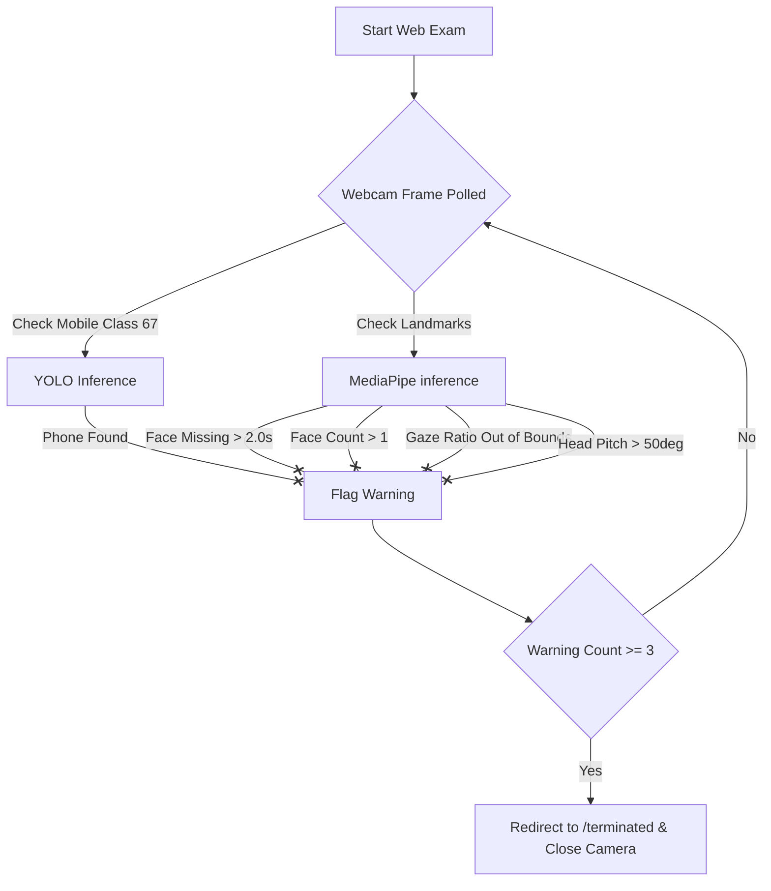

# EyeGesture Commands Manual

This manual provides instructions for configuring, executing, and validating the **EyeGesture Module**, an AI-driven, hands-free navigation and exam proctoring system.

---

## 1. Project Overview

The **EyeGesture Module** is a dual-purpose computer vision system that runs on your local webcam. It contains two core modules:

1.  **Cursor & Gesture Navigation Mode**: Move your mouse cursor with your head, click with your eyes, and scroll web pages or files with your hand.
2.  **AI Exam Proctoring Mode**: A simulated online quiz dashboard that tracks eye gaze, head pose, multiple persons, and mobile phones to detect exam cheating.

Both modules run concurrently by sharing a single webcam device thread-safely through a global camera manager.

---

## 2. Installation Requirements

### A. Python Version
*   **Required**: Python 3.12 (Windows x64)

### B. Required Packages
Install these python packages using pip:
```bash
pip install opencv-python opencv-contrib-python mediapipe Flask ultralytics pyautogui numpy torch torchvision
```

### C. Required Model Files
The following pre-trained models must be placed in the project root directory:
1.  **`yolov8n.pt`** (6.25 MB): Pre-trained YOLOv8 Nano weights for object detection.
2.  **`face_landmarker.task`** (3.58 MB): MediaPipe Face Landmarker model.
3.  **`hand_landmarker.task`** (7.46 MB): MediaPipe Hand Landmarker model.

---

## 3. Startup Instructions

1.  Open your command shell (PowerShell or Command Prompt) and navigate to the project directory:
    ```bash
    cd c:\project1\EyeGesture_Module
    ```
2.  Run the Flask server:
    ```bash
    python app.py
    ```
3.  **Expected Startup Output**:
    ```text
    Map([<Rule '/static/<filename>' (HEAD, GET, OPTIONS) -> static>,
     <Rule '/' (HEAD, GET, OPTIONS) -> home>,
     <Rule '/start_mouse' (HEAD, GET, OPTIONS) -> start_mouse>,
     <Rule '/stop_mouse' (HEAD, GET, OPTIONS) -> stop_mouse>,
     <Rule '/camera' (HEAD, GET, OPTIONS) -> camera_page>,
     <Rule '/exam' (HEAD, GET, OPTIONS) -> exam>,
     <Rule '/video_feed' (HEAD, GET, OPTIONS) -> video_feed>,
     <Rule '/exam_status' (HEAD, GET, OPTIONS) -> exam_status>,
     <Rule '/submit_exam' (POST, OPTIONS) -> submit_exam>,
     <Rule '/terminated' (HEAD, GET, OPTIONS) -> terminated>])
     * Serving Flask app 'app'
     * Debug mode: on
     * Running on http://127.0.0.1:5000
    ```

---

## 4. Browser Instructions

Open your web browser (Chrome, Edge, or Firefox) and navigate to the local addresses below:

*   **Home/Landing Dashboard**: [http://127.0.0.1:5000/](http://127.0.0.1:5000/)
*   **Proctored Exam Portal**: [http://127.0.0.1:5000/exam](http://127.0.0.1:5000/exam) (Navigating here triggers face tracking, gaze tracking, and cheating checks).
*   **Activate AI Cursor**: [http://127.0.0.1:5000/start_mouse](http://127.0.0.1:5000/start_mouse) (Returns a JSON confirmation stating `{"status": "Cursor Mode Started"}`).
*   **Deactivate AI Cursor**: [http://127.0.0.1:5000/stop_mouse](http://127.0.0.1:5000/stop_mouse) (Returns a JSON confirmation stating `{"status": "Cursor Mode Stopped"}`).

---

## 5. Gaze Features

Gaze tracking triggers warnings if you look away from the test interface.

### How to test:
1.  Navigate to `/exam`. Your live proctor camera stream will appear in the top-right corner.
2.  Perform the following look directions to verify detection:
    *   **Look Left**: Turn your eyes far left.
    *   **Look Right**: Turn your eyes far right.
    *   **Look Up**: Look towards the ceiling.
    *   **Look Down**: Look towards your desk.
    *   **Bow Head**: Lower your chin towards your chest.
3.  **Expected Behavior**:
    *   The proctor camera overlay will register eye boundaries and show violation warnings.
    *   A notification banner at the bottom of the screen will show: `🚨 WARNING: Violation X/3 Detected!`.

---

## 6. Blink Features (AI Cursor Mode)

When AI Cursor mode is activated (`/start_mouse`), your eye blinks correspond to mouse click triggers.

1.  **Left Click (Short Blink)**:
    *   *Trigger*: Close both eyes and open them quickly (duration between `0.15` and `0.6` seconds).
    *   *Expected Behavior*: A single left-click is registered on your OS cursor.
2.  **Double Click (Long Blink)**:
    *   *Trigger*: Close both eyes and hold them closed for a moment (duration greater than `0.6` seconds).
    *   *Expected Behavior*: A double left-click is registered (opens folders/files).

> [!NOTE]
> During exam mode, eye blinks are filtered out so that closing your eyes naturally does not trigger false looking-down warnings.

---

## 7. Gesture Features (AI Cursor Mode)

1.  **Move Cursor (Nose Tracking)**:
    *   *Trigger*: Move your head up, down, left, or right.
    *   *Expected Behavior*: The cursor tracks the movement of your nose tip on the screen. The mapping is smoothed (smoothing factor = 7) to prevent jitter.
2.  **Scroll Pages (Hand Tracking)**:
    *   *Trigger*: Hold up your hand with your index finger extended, then slide your index finger vertically.
    *   *Expected Behavior*:
        *   Moving your finger upward scrolls the page **up**.
        *   Moving your finger downward scrolls the page **down**.

---

## 8. Cheating Detection Features

The proctoring engine tracks five distinct cheating vectors.



*   **Mobile Phone Detection**: Raising a phone into the frame triggers a `mobile_detected` violation.
*   **Multiple-Person Detection**: If more than one face is visible, it triggers a `multiple_persons` violation.
*   **Face-Not-Visible Detection**: If the camera is covered or the candidate leaves the frame for more than `2.0` seconds, it triggers `face_not_visible`.
*   **Warning Limits**: A maximum of **3 warnings** are allowed before the proctoring engine automatically shuts down the session.
*   **Termination Flow**: Upon the 3rd warning, the webcam is released, the exam closes, and the browser redirects to `/terminated` displaying screenshots and time logs of all violations.

---

## 9. Troubleshooting

*   **Camera fails to open / locks up**:
    *   Verify that no other software (Zoom, Teams, Discord, or web browsers) is using the webcam.
    *   Only one thread/process can access the physical camera.
*   **Flask fails to start**:
    *   Ensure all python packages are installed. Run `pip list` to check for missing packages.
*   **Model loading error**:
    *   Verify `face_landmarker.task`, `hand_landmarker.task`, and `yolov8n.pt` are in the root directory.
*   **`AttributeError: function 'free' not found`**:
    *   This is a Python 3.12 ctypes loader compatibility issue with legacy MediaPipe releases. Upgrade `mediapipe` to version `0.10.35`:
        ```bash
        pip install --upgrade mediapipe
        ```

---

## 10. Validation Checklist

A new user can run the following sequence to verify all features:

- [ ] **1. Server Launch**: Execute `python app.py`. Open [http://127.0.0.1:5000/](http://127.0.0.1:5000/) and confirm the dashboard loads.
- [ ] **2. Camera Access**: Navigate to `/camera` or `/exam`. Confirm your camera indicator light turns on and video streams smoothly.
- [ ] **3. Gaze Warning (Left)**: Turn your head far left. Confirm a warning notification banner appears at the bottom of the screen.
- [ ] **4. Face Missing**: Cover your webcam with your hand for 3 seconds. Confirm a warning banner appears.
- [ ] **5. Phone Detection**: Hold a mobile phone in front of your face. Confirm a warning banner appears.
- [ ] **6. Exam Termination**: Trigger a total of 3 warnings. Confirm that the browser automatically redirects to the `/terminated` page showing logs and screenshots.
- [ ] **7. Start AI Cursor**: Open [http://127.0.0.1:5000/start_mouse](http://127.0.0.1:5000/start_mouse). Confirm the JSON response indicates `Cursor Mode Started`.
- [ ] **8. Head Cursor Movement**: Move your head in a circle. Verify that your system mouse cursor follows your head movement.
- [ ] **9. Blink Click**: Place your cursor over a folder or web link, then blink quickly. Verify that a mouse click event fires.
- [ ] **10. Hand Scrolling**: Raise your hand in front of the camera, then move your index finger up and down. Verify that the current page scrolls.
- [ ] **11. Stop AI Cursor**: Open [http://127.0.0.1:5000/stop_mouse](http://127.0.0.1:5000/stop_mouse). Confirm the JSON response indicates `Cursor Mode Stopped` and head movement no longer moves the cursor.
